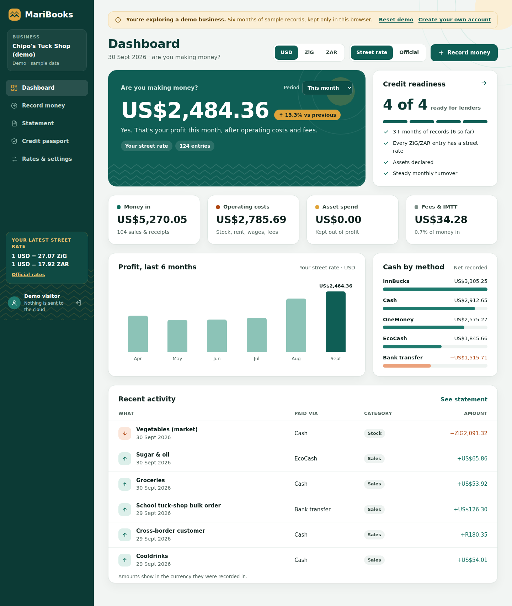

# MariBooks

Dead-simple, multi-currency bookkeeping for African small businesses that doubles as a
credit-readiness engine. Capture money in and out across USD, ZiG and ZAR and many payment
rails (cash, EcoCash, OneMoney, InnBucks, Zipit, bank, card), see your true profit in one
currency, and turn your record into a lender-ready statement and a shareable credit passport.

Built as a **serverless web app on AWS** for the [Zero to Shipped](https://builder.aws.com/build/hackathons/e83e84e5-4f4c-383b-bbe9-4a15ac195d55/zero-to-shipped)
hackathon. Category: `#commercial-potential` · Lane: `#startups`.

**Live:** https://d3vn6ch6zctfj4.cloudfront.net · **Try the demo, no sign-up:** https://d3vn6ch6zctfj4.cloudfront.net/?demo
· **Submission write-up:** [`submission/SUBMISSION.md`](submission/SUBMISSION.md)



## What makes it different
- **Honest multi-currency.** Amounts are stored in the currency they happened in and
  translated on demand — never silently mixed.
- **Real vs official rates.** The owner enters the **market rate they actually transacted at**;
  a separate official reference table drives statutory-styled reports. Every figure shows its
  rate basis.
- **Fees & IMTT modelled honestly**, separate from principal.
- **Asset tagging.** Purchases that are assets are kept out of profit and build a declared
  asset base for funding applications.
- **Credit passport.** Turnover, cash-flow stability, continuous records and declared assets —
  shared only with explicit, revocable consent.
- **Paste a payment SMS.** EcoCash / InnBucks / bank confirmations fill the form (rules parser
  in the browser; optional Amazon Bedrock refinement on the API).
- **Works on bad connections.** Failed saves queue on the device and sync later; the app shell
  loads offline.

## Repository layout
```
maribooks/
├─ shared/     # framework-free TypeScript domain logic (money, FX, ledger, reporting, passport)
├─ web/        # React + Vite SPA (capture, dashboard, statement, passport)
├─ api/        # AWS Lambda (Node.js 18) sync API over DynamoDB
├─ infra/      # AWS SAM template (API Gateway, Lambda, DynamoDB, S3, CloudFront, Cognito, ...)
├─ submission/ # hackathon submission pack + checklist
└─ .kiro/specs/maribooks-mvp/   # requirements, design, infrastructure, tasks
```

## Specs
The build is spec-driven. See:
- [`requirements.md`](.kiro/specs/maribooks-mvp/requirements.md)
- [`design.md`](.kiro/specs/maribooks-mvp/design.md)
- [`infrastructure.md`](.kiro/specs/maribooks-mvp/infrastructure.md)
- [`tasks.md`](.kiro/specs/maribooks-mvp/tasks.md)

## Getting started (local)
```bash
npm install            # installs all workspaces
npm run build:shared   # build the domain package
npm test               # run unit tests
npm run dev:web        # start the SPA locally — open /?demo to use the demo business
```

## Deploy (AWS serverless, region af-south-1)
See [`infrastructure.md` §6](.kiro/specs/maribooks-mvp/infrastructure.md) for the full
procedure. In short:
```bash
npm run build
sam build && sam deploy --guided     # from infra/
aws s3 sync web/dist s3://<SpaBucket> --delete
aws cloudfront create-invalidation --distribution-id <DistId> --paths "/*"
```

## Status
Specs complete; scaffolding in place. Application code and deployment follow (pending AWS
access). Requires Node.js 18+.
# MariBooks
# MariBooks
