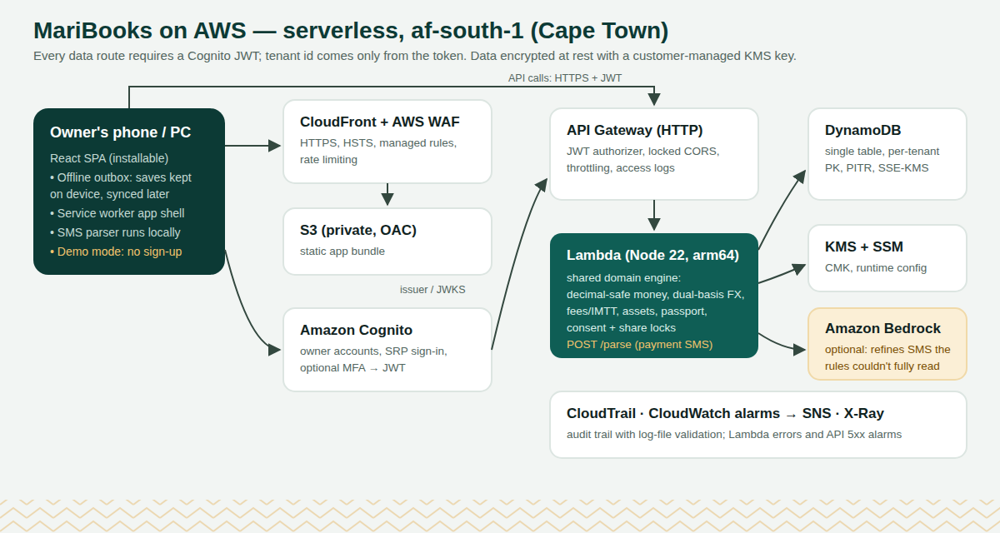
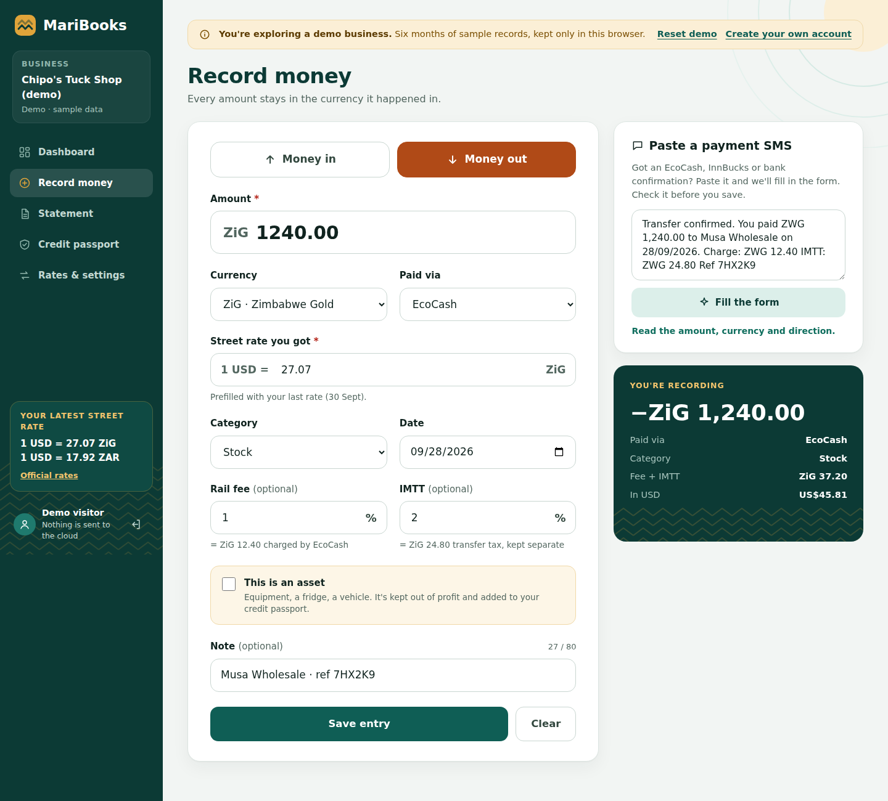
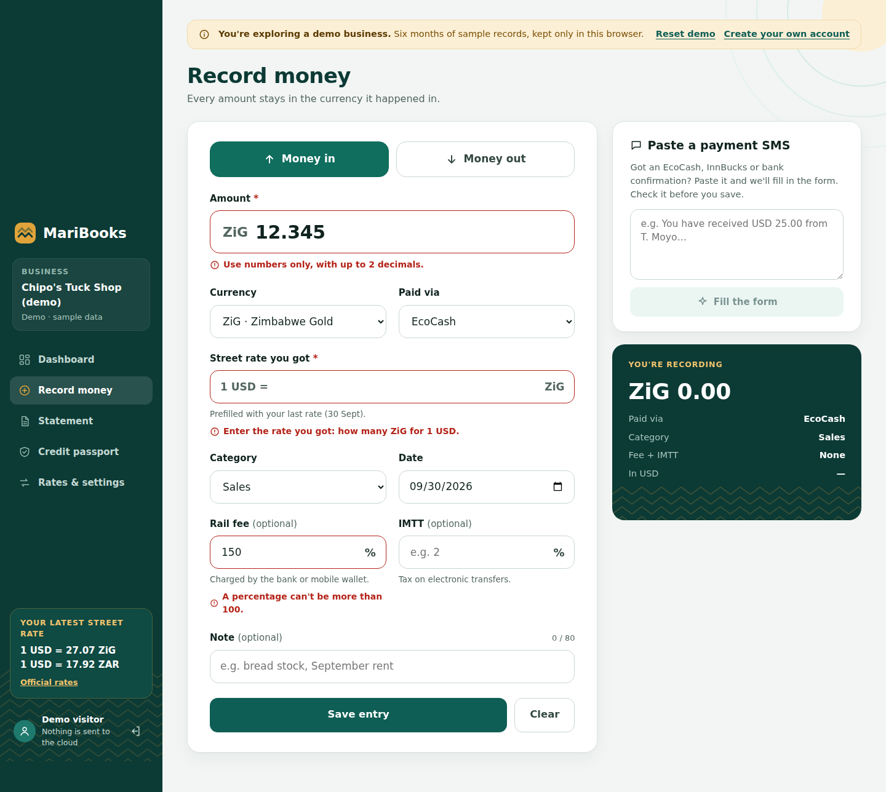
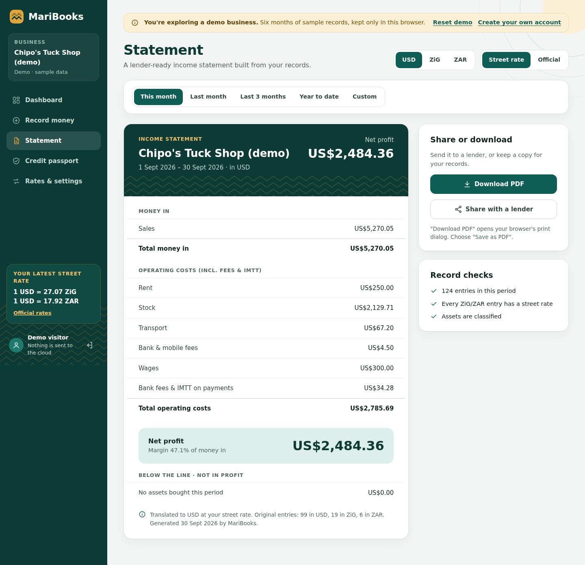
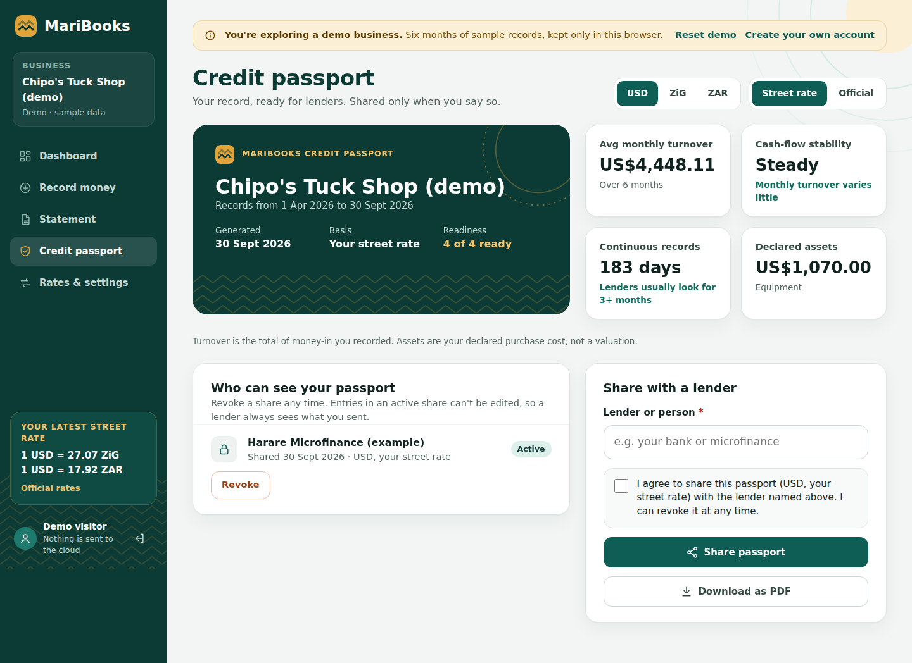
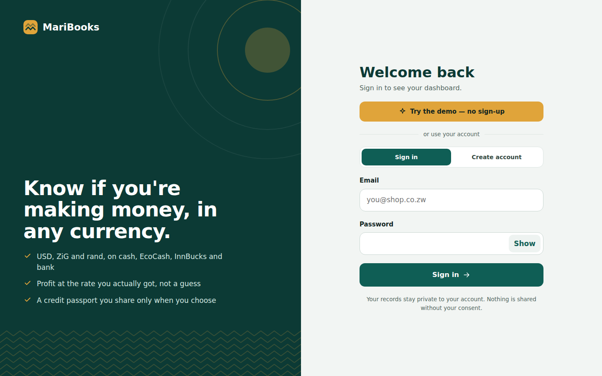
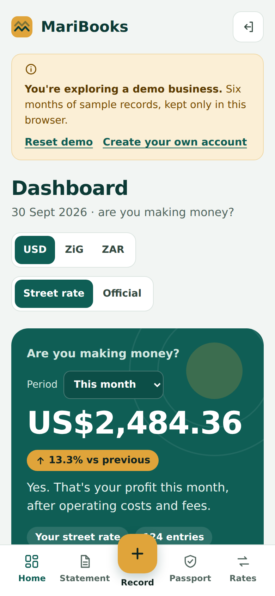

# MariBooks — know if you're making money, in any currency

**Live app:** https://d3vn6ch6zctfj4.cloudfront.net
**Try it with no sign-up:** https://d3vn6ch6zctfj4.cloudfront.net/?demo — a demo business with six months of records
**Code:** https://github.com/blak-tinkerbell/MariBooks
**Category:** `#commercial-potential` · **Lane:** `#startups`
**Built with:** an AI coding agent connected to AWS ([proof](./aws-connection-proof.md)), deployed to AWS af-south-1 (Cape Town)

> *Mari* is Shona for money.

---

## The problem (the story)

‹PERSONALISE: replace this paragraph with one real owner you know — name, town, what they sell. Get their permission. Keep it this short.›

Picture a tuck-shop owner in Harare. In one day she is paid in US dollars in cash, in ZiG on EcoCash, and in rand by a cross-border customer. She buys stock with a bank transfer that costs 2% IMTT and pays rent from her mobile wallet. At the end of the month she has a notebook full of numbers in three currencies at different rates, and she still cannot answer one question: **am I making money?**

Because her records are scattered, a lender cannot see a trading history, so she cannot borrow to buy the fridge that would grow the business.

MariBooks answers that question in one screen and turns the same records into a **credit passport** she can share with a lender and take back when she chooses.

## What it does

| | |
|---|---|
| **Record money in seconds** | Money in / out, in USD, ZiG or ZAR, on cash, EcoCash, OneMoney, InnBucks, Zipit, bank or card. Every amount stays in the currency it happened in. |
| **Paste the SMS instead of typing** | Paste an EcoCash, InnBucks or bank confirmation SMS and the form fills itself: amount, currency, direction, rail, fee, IMTT, reference, date. It never reads the running balance as the amount. |
| **Fees and IMTT as percentages** | Enter "2%" and MariBooks works out the charge and keeps it separate from the principal, so profit is honest. |
| **The rate you actually got** | For ZiG and ZAR the owner enters the **street rate** they traded at. A separate **official** rate table drives statutory-style reports. Every figure shows which basis it uses. |
| **"Are you making money?"** | Dashboard: profit for the period with the change on the previous one, money in, operating costs, asset spend, fees & IMTT, six-month profit trend, cash by payment method, recent activity. Switch the view between USD / ZiG / ZAR and street / official in one tap. |
| **Assets kept out of profit** | Buying a fridge doesn't wreck a month's profit. It's tagged as an asset and builds the declared asset base. |
| **Lender-ready statement** | Income statement for any period: money in, operating costs by category, net profit and margin, assets below the line, rate basis and currency mix disclosed. Download as PDF. |
| **Credit passport, with consent** | Average monthly turnover, cash-flow stability, continuous-record length, declared assets, and a 4-point readiness check. Shared only after explicit consent, revocable at any time. Entries in an active share are locked, so a lender always sees exactly what was sent. |
| **Works on bad connections** | If a save fails because the connection dropped, the entry is kept on the device and synced when the connection returns — idempotent ids mean it is never duplicated. The app shell loads offline. |
| **Every field validated** | Amounts (positive, 2 decimals), percentages (0–100, with a warning above 20%), rates, dates (not in the future), asset details, notes (80 chars), passwords matching the account policy — with plain-language messages next to the field. |

## Creativity & storytelling

- **One question, answered first.** The landing screen is literally "Are you making money?" with a yes/no sentence, not a ledger.
- **Built for how money moves in Zimbabwe:** three currencies, seven payment rails, IMTT, a street rate that differs from the official one. These aren't edge cases here; they're every day.
- **The design carries the place.** The chevron pattern throughout the app comes from the walls of Great Zimbabwe; deep teal and marigold are the palette.
- **One record, three beneficiaries:** the owner sees profit, the lender sees a trustworthy history, and the same data can later feed tax compliance.

## Technical innovation

1. **Store-native, translate-late ledger.** Amounts are stored in their original currency as decimal strings and converted only when a report is built. Money maths uses scaled BigInt — never binary floats — with half-up rounding.
2. **Dual rate basis.** Each foreign-currency entry carries the owner's effective (street) rate; reports can instead use a dated official rate table (most-recent-on-or-before lookup, inverse pairs handled). The basis label travels with every figure.
3. **Honest fees.** Rail fees and IMTT are stored separately from principal and counted as operating costs on both money in and money out. (The agent's end-to-end test caught that fees on money *received* were being dropped from profit; it's fixed and covered by a test.)
4. **Payment-SMS parser.** A deterministic parser in the shared domain package reads amount, currency (incl. ZWG → ZiG), direction, rail, fee, IMTT, counterparty, reference and date, strips running balances first, and reports its own confidence. It runs in the browser with no network. On the server, `POST /parse` can hand low-confidence messages to **Amazon Bedrock** (optional, one CloudFormation parameter); the model's output is re-validated against the domain enums before use, and rule-extracted fields always win.
5. **Consent-gated, lockable sharing.** A share can only be created with an explicit consent flag (enforced in the domain *and* the API). Transactions in an active share are locked against edit/delete server-side (HTTP 409), so a shared passport can't be quietly changed.
6. **Offline-tolerant capture.** Client-generated UUIDs are idempotency keys, so the outbox can resend safely; the API's PutItem on PK+SK makes retries produce exactly one record.
7. **Security for financial data:** Cognito JWT on every route, tenant id only from the token claim, customer-managed KMS encryption, PITR, least-privilege IAM, locked CORS, WAF, CloudTrail with log-file validation, alarms to SNS.

**Tests:** 37 domain unit tests (money, FX, ledger, reporting, passport, assets, SMS parser, fees on money in) + 4 API integration tests (idempotent retries, recoverable failed saves, SMS parse route).

## Community & market impact

- **Who it's for:** micro and small businesses in Zimbabwe — tuck shops, market traders, salons, hardware, cross-border traders — who deal in USD, ZiG and ZAR at once.
- **Why it matters:** ‹ADD 1–2 SOURCED FIGURES — e.g. the size of Zimbabwe's MSME sector and its access-to-credit gap. Good sources: FinScope MSME Survey Zimbabwe, the Reserve Bank of Zimbabwe's financial inclusion strategy, World Bank Enterprise Surveys. Cite the source and year next to each number.›
- **Early users:** ‹ADD what happened when real owners used it — how many, how many entries, one direct quote with permission. Even three people for two days is evidence.›
- **What changes for an owner:** they can see profit at the rate they actually got, see how much fees and IMTT cost them, and hand a lender a statement and passport instead of a notebook.

## Where it's headed (Startups lane)

- **Business model:** free for owners to record and see profit; lenders and microfinance institutions pay for verified, consented passports and statements; premium tax-ready reports for growing SMEs.
- **Next:** a lender view reached through the share link, WhatsApp and USSD capture for feature phones, receipt photos, ZIMRA fiscal-invoice integration, and more languages (Shona and Ndebele).
- **Flywheel:** the more an owner records, the stronger their passport, the more reason to keep recording.

## How the coding agent helped me ship

The project was built spec-first with an AI coding agent connected to the AWS account ([connection proof](./aws-connection-proof.md)). The specs it drafted and then executed are in [`.kiro/specs/maribooks-mvp/`](../.kiro/specs/maribooks-mvp/): [requirements](../.kiro/specs/maribooks-mvp/requirements.md) → [design](../.kiro/specs/maribooks-mvp/design.md) → [tasks](../.kiro/specs/maribooks-mvp/tasks.md).

Concrete moments:
- **Infrastructure:** provisioned four CloudFormation/SAM stacks (core API, hosting, WAF in us-east-1, audit) and verified them live — JWT enforcement (401), CORS locked to the app origin, WAF attached, CloudTrail logging ([DEPLOYED.md](../infra/DEPLOYED.md)).
- **Redesign from screenshots:** turned a cramped phone-width prototype into a full web app — first as a clickable design, then implemented in React — with a sidebar on desktop, a bottom bar on phones, the dashboard as the landing page, and field-level validation everywhere.
- **Bugs caught by testing, not by users:** an end-to-end browser test showed that a fee on money *received* didn't reduce profit; the agent fixed the shared reporting engine and added a regression test. It also found the API build had been failing on a missing type package, and that the demo data skipped rent when the 1st fell on a Sunday.
- **Judge-friendly by design:** the agent added the no-sign-up demo so anyone reaching the URL sees a working business immediately.
- ‹PERSONALISE: add one moment in your own words — something the agent did that surprised you or saved you a day.›

## Try it (60 seconds)

1. Open **https://d3vn6ch6zctfj4.cloudfront.net/?demo**.
2. **Dashboard:** switch USD → ZiG → ZAR and Street rate → Official. Every figure recalculates and says which basis it uses.
3. **Record money:** paste `You paid ZWG 1,240.00 to Musa Wholesale on 28/09/2026. Charge: ZWG 12.40 IMTT: ZWG 24.80 Ref 7HX2K9` into "Paste a payment SMS" → **Fill the form**. Try an amount like `12.345` or a fee of `150` to see validation.
4. **Statement:** pick a period → **Download PDF**.
5. **Credit passport:** share with a lender (consent required), then revoke it.

## Screenshots

| | |
|---|---|
|  |  |
|  |  |
|  |  |

## Team & eligibility
- **Builder:** ‹CONFIRM name + Builder Center profile›
- **18 or older, eligible country, not an excluded employee:** ‹CONFIRM against the Rules tab›
- **Original, not previously published:** ‹CONFIRM›

*Product concept: `MariBooks_Product_Concept.docx` (Ushauri Consulting).*
