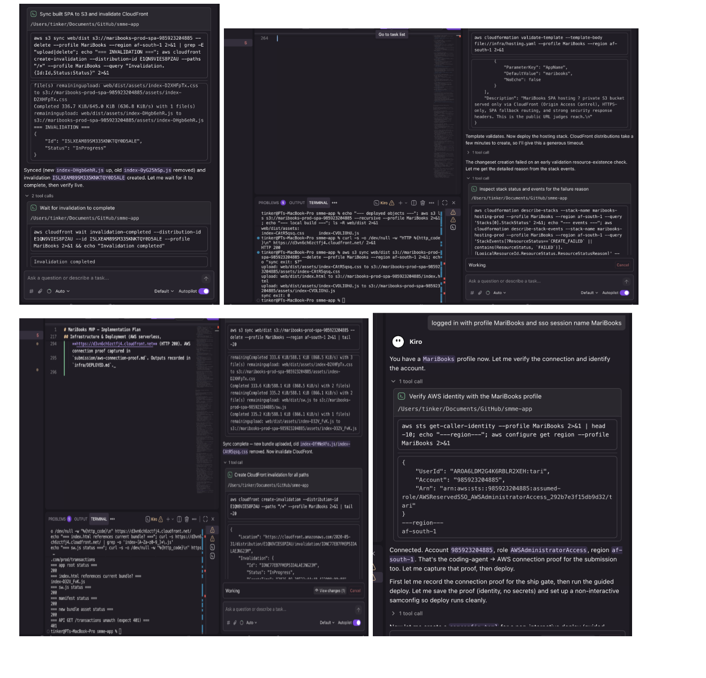

# Coding-agent → AWS connection proof

Captured: 2026-09-30T21:56:47Z
Region: af-south-1
Auth: AWS IAM Identity Center (SSO), profile MariBooks, role AWSAdministratorAccess

```
$ aws sts get-caller-identity --profile MariBooks
{
    "UserId": "####################:tari",
    "Account": "############",
    "Arn": "arn:aws:sts::############:assumed-role/AWSReservedSSO_<permission-set>/tari"
}
```

> Account ID, user ID and SSO role identifiers are redacted for the public repo.

## Agent session screenshots

Kiro verifying the identity, deploying and validating the CloudFormation stacks, syncing the SPA
to S3, invalidating CloudFront and verifying the live app (200s on the app, 401 on an
unauthenticated API call):


